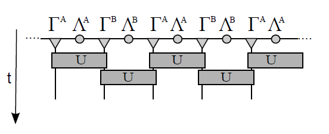

# Infinite Time Evolving Block Decimation (iTEBD)

## Name: Zheng-Lin Tsai             &ensp; Student ID: s106022501

### 1.Method

In quantum mechanics, the time-dependent wave function is  , U(t) is time evolution operator.  

If time is very long, we expect state is most stable state. So we can find ground state  .  

By Schrödinger equation, we can get  , then set =1 and use imaginary time , so rewrite imaginary time operator  .  

Next,  h is local two site hamiltonian and [1,2] is index of site , collect [1,2], [3,4], [5,6]... into odd hamiltonian  , also .  
So  [1, 2].   

And use Trotter-Suzuki decomposition  ,  is a small parameter.  

In order to use Trotter-Suzuki decomposition, we need slice imaginary time  , N is number of slices.  

So we get  , and  , show graphically    

Above picture express by Matrix Product States (MPS)[1], and we consider infinite chain that mean each site must the same (translation invariant), we only updata two site and then we can get ground state.  

### 2.Coding
The code use Uni10 library[3].  

### 3.References
[1] Frank Pollmann Efficient Numerical Simulations Using Matrix-Product States   
[2] G. Vidal. Classical simulation of infinite-size quantum lattice systems in one spatial dimension. arXiv:cond-mat/0605597    
[3] Uni10: an open-source library for tensor network algorithms. https://gitlab.com/uni10/uni10   
